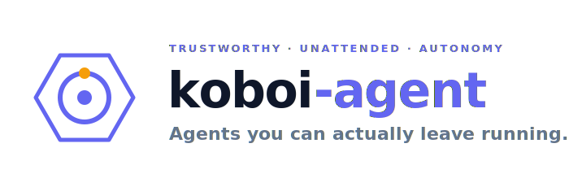
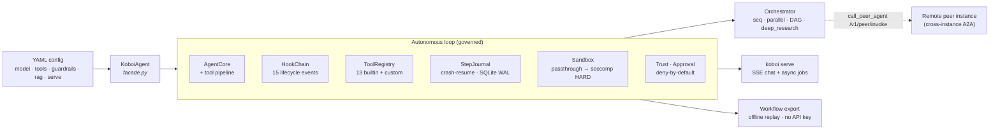

<div align="center">
  <picture>
    <source media="(prefers-color-scheme: dark)" srcset="docs/assets/koboi-banner-dark.svg">
    
  </picture>

  <br/><br/>

  [](https://github.com/hedypamungkas/koboi-agent/actions/workflows/ci.yml)
  [](https://codecov.io/gh/hedypamungkas/koboi-agent)
  [](https://pypi.org/project/koboi-agent/)
  [](https://pypi.org/project/koboi-agent/)
  [](https://github.com/hedypamungkas/koboi-agent/blob/main/LICENSE)
  [](https://github.com/hedypamungkas/koboi-agent/actions/workflows/docker.yml)

  <br/>

  <strong>Self-hostable AI agents you can actually leave running.</strong><br/>
  Durable crash-resume · governed autonomy · seccomp sandbox · offline-replayable · CI-native eval — all at the library level.

  <br/>

  <a href="#quickstart">Quickstart</a> &nbsp;·&nbsp;
  <a href="#how-koboi-compares">vs LangGraph / CrewAI / OpenAI Agents SDK</a> &nbsp;·&nbsp;
  <a href="#features">Features</a> &nbsp;·&nbsp;
  <a href="docs/architecture.md">Architecture</a> &nbsp;·&nbsp;
  <a href="docs/trustworthy-unattended-autonomy.md">Positioning</a>

</div>

---

> **koboi-agent** is an MIT-licensed, async-Python framework for building AI agents you can run **unattended** — background jobs, long sessions, tool-using assistants that touch real systems. You configure a whole agent stack (model, tools, guardrails, RAG, serving) from one YAML file, then run it as a CLI, a library, or a self-hosted server. Most agent frameworks are great for demos; koboi is built for the boring question that decides whether a demo becomes production: *what happens when it crashes, when it's told to do something unsafe, or when no one is watching?*

## Why koboi

Four things, rare **together at the library level**, make an agent safe to leave running:

- 🛡️ **Durable by default** — Sessions survive crashes, redeploys, and `SIGKILL`. A SQLite step journal writes a `running` marker *before* every LLM call, so `koboi run --resume <session>` rehydrates and re-runs **only the tool calls that never finished** — non-idempotent tools (`write_file`, `run_shell`) are never silently replayed. See [`benchmarks/crash_recovery/run.py`](benchmarks/crash_recovery/run.py) for a reproducible crash→resume demo.
- 🧱 **Governed autonomy** — Agents act, but only inside a seccomp-isolated sandbox (syscall-level egress deny, no container required), with **deny-by-default approvals**, a trust database, rate limits, and guardrails. The **C3 contract**: autonomous destructive jobs are *refused* unless `sandbox.backend='restricted'`.
- 🔁 **Offline-replayable & CI-native** — Freeze any run into a re-runnable bundle, optionally with its LLM response cache, for byte-identical replay with **no API key** (`koboi capture --with-cache` → `run --replay-mode replay`). Treat agent behavior like code with an eve-style eval DSL that runs mock-deterministic on every commit (`koboi eval-test --mock`).
- 🏠 **Self-hostable, no platform upsell** — `koboi serve` is a real FastAPI service: interactive SSE chat with human-in-the-loop approvals **and** autonomous background jobs (Bearer keys, per-session ownership, idempotency, durable resume, HMAC webhooks). Run it on your own infrastructure — no managed tier required for durability or governance.

> [!NOTE]
> Several headline features — **self-healing**, **proactive memory**, **grounding/handover**, **multimodal**, **cross-instance A2A**, **deep research**, **deterministic replay**, and **seccomp HARD** isolation — are **opt-in / default-off** so the default install stays minimal and predictable. Each is documented where it appears. See [Honest limitations](#honest-limitations) for where koboi is deliberately lean.

## Quickstart

```bash
pip install koboi-agent
export OPENAI_API_KEY=sk-...        # or ANTHROPIC_API_KEY / CLOUDFLARE_API_KEY
# (cloned the repo? `cp .env.example .env` and edit it — koboi auto-loads .env)
```

One-shot from the CLI (works on a bare install, no extras):

```bash
koboi run configs/simple_chat.yaml -m "What is 2 + 2?"
```

Or as a library:

```python
import asyncio
from koboi import KoboiAgent

async def main():
    async with KoboiAgent.from_config("configs/simple_chat.yaml") as agent:
        result = await agent.run("What is 2 + 2?")
        print(result.content)

asyncio.run(main())
```

<details>
<summary><b>Optional extras</b> (each unlocks one surface; the bare install covers <code>run</code>, <code>validate</code>, <code>keys</code>, <code>mcp-serve</code>, <code>eval-test</code>, <code>graph</code>, <code>export</code>/<code>capture</code>, <code>workflows</code>)</summary>

```bash
pip install koboi-agent[tui]            # interactive `koboi chat` (Textual TUI) + examples (click + rich)
pip install koboi-agent[api]            # `koboi serve` (FastAPI HTTP/SSE server)
pip install koboi-agent[tokenizer]      # accurate OpenAI token counts (tiktoken); chars/3 heuristic is the fallback
pip install koboi-agent[rerank-local]   # local BGE cross-encoder rerank (jina/cohere are hosted APIs, no extra)
pip install koboi-agent[indo-nlp]       # Indonesian stemmer (Sastrawi) for lexical RAG
pip install koboi-agent[media-cloud]    # R2/S3 media-artifact storage (local storage needs no extra)
pip install koboi-agent[rag]            # RAG document parsers (pypdf / python-docx / pdfplumber)
pip install koboi-agent[browser]        # Playwright fetch provider (then `playwright install chromium`)
pip install koboi-agent[tracing]        # Langfuse observability
pip install koboi-agent[dev,tui,api]    # everything (contributors)
```

System packages (not pip): `python3-seccomp` for HARD sandbox isolation (Linux only); `playwright install chromium` for the browser fetch provider.

</details>

## See it in 60 seconds: an agent that survives a crash

The fastest way to *see* the difference is durability. Start a run, kill it mid-flight, and resume:

```bash
# kick off a long-running, tool-using task, then Ctrl-C / kill the process mid-run
koboi run configs/simple_chat.yaml -m "Read ./data and summarize each file"

# list the interrupted session and resume it — only the unfinished tool calls re-run
koboi sessions configs/simple_chat.yaml
koboi run   configs/simple_chat.yaml --resume <session>
```

Reproducible benchmark with wall-clock numbers: `python benchmarks/crash_recovery/run.py`.

Another "wait, it does *that*?" moment — **human-in-the-loop on a self-hosted server**, on a bare install:

```bash
pip install koboi-agent[api] && koboi keys create
koboi serve configs/hitl_demo.yaml          # interactive SSE chat with approval prompts
python examples/hitl_client.py              # httpx-only client that auto-resolves pending_approval events
```

## How koboi compares

koboi's edge is the **integration** of durability + sandbox isolation + governed approval + self-hostable serving + CI-native eval at the framework core — it's rare to find all five together without a managed platform tier. Where koboi is leaner, we say so.

| Capability | koboi | LangChain / LangGraph | CrewAI | OpenAI Agents SDK |
|---|:--:|:--:|:--:|:--:|
| Multi-provider LLM | ✅ OpenAI / Anthropic / Cloudflare | ✅ broadest | ✅ | ✅ |
| **Crash/redeploy resume at library level** | ✅ `--resume`, non-idempotent-tool safe, on by default | ◐ checkpointer (manual wiring) | — | — |
| **Seccomp sandbox (no container) + deny-by-default approval + trust DB** | ✅ | ◐ minimal | ◐ HITL gates | ◐ container Sandbox Agents |
| **Self-hostable server: interactive SSE + async jobs** | ✅ `koboi serve` | ◐ LangServe / Platform | ◐ Enterprise | — |
| **Deterministic offline replay (no API key)** | ✅ | — | — | — |
| **CI-native eval-as-code (mock-deterministic)** | ✅ `koboi eval-test` | ◐ LangSmith (platform) | ◐ | — |
| Multi-agent orchestration (seq / parallel / DAG / deep research) | ✅ | ✅ LangGraph | ✅ Flows | ◐ handoffs |
| MCP client **and** server | ✅ | ✅ | ◐ | ✅ |
| Cross-instance agent-to-agent (A2A + trace) | ✅ | ◐ via Platform | ◐ | — |
| Multimodal generation (image/video/music/speech/STT) | ✅ | ◐ wrappers | ◐ | ◐ via API tools |

✅ = first-class, library-level &nbsp;·&nbsp; ◐ = partial / separate product / platform tier &nbsp;·&nbsp; — = not a focus

<details>
<summary><b>What koboi is (and isn't)</b></summary>

koboi is an **autonomous-loop** framework (the Claude Code / AutoGPT family) with multi-agent coordination layered on top — not a pure workflow-graph engine like LangGraph or CrewAI Flows. It shines for *agents you leave running*; if your primary need is a large, visual node-graph DAG runtime, LangGraph is the stronger choice there.
</details>

## Features

| Area | What you get |
|---|---|
| **Models** | OpenAI, Anthropic, Cloudflare Workers AI; `ProviderPool` failover + named-providers resolver — switch models without rewriting agents |
| **Tools** | 13 builtin modules (calculator, filesystem, shell, web, memory, search, git, subagent, task, ingest, handover, media, peer) + custom tools via `@tool()`; sync or async, dependency-injected |
| **Safety** | Input/output guardrails, policy engine, approval handlers, graduated trust DB, rate limiting, audit trail, secret redaction |
| **Sandbox** | Passthrough (default) or restricted: per-session workdir, rlimits, PATH allowlist, secret-stripped env, SOFT token-scan or **HARD seccomp** syscall egress deny (Linux) |
| **Memory** | In-memory or SQLite-WAL (hosts the step journal); opt-in **proactive long-term memory** (auto-extract facts → semantic recall each turn → always-in-context core block) |
| **Hooks** | 15 lifecycle events + 24+ specialized hooks; declarative **external-command hooks** (`hooks:` YAML — no Python required) |
| **RAG** | Chunking (fixed/sentence/paragraph/semantic), retrieval (keyword/BM25/semantic/hybrid), cross-encoder rerank (jina/cohere/local), query rewrite/HyDE, metadata filters, Indonesian stopwords+stemmer, HTTP/S3 sources — no vector DB required |
| **Web** | Pluggable search/fetch providers (mock, DuckDuckGo, Brave, Firecrawl + httpx/readability/Playwright) behind `web_search`/`web_fetch` |
| **Orchestration** | Keyword/LLM/hybrid routing; sequential, parallel, DAG, conditional, dynamic (LLM-planned); **deep_research** mode (plan → search → fetch → coverage-gate → cited report) |
| **Confidence & handover** | Opt-in grounding guardrail (claim-decompose + NLI judge, abstains when ungrounded) + `transfer_to_human` tool + handover detection + warm-handoff digest |
| **Self-healing** *(opt-in)* | Bounded verifier-grounded reflection → escalation ladder (retry → reflect → replan → handover) under a shared recovery budget → graceful degrade on `max_iterations`; optional CRITIC + self-consistency |
| **Multimodal** *(opt-in)* | image/video/music/speech + transcription via a pluggable gateway (Surplus; mock offline) — agent tools, sync+async REST, R2/S3 storage, budget caps |
| **Cross-instance A2A** *(opt-in)* | `call_peer_agent` tool + `POST /v1/peer/invoke` inbound + signed agent-card discovery + W3C trace propagation; a remote peer as a first-class orchestration node |
| **Determinism** *(opt-in)* | `koboi export`/`capture` freezes a run + optional response cache; `run --replay-mode replay` is byte-identical and **offline** |
| **MCP** | Client (stdio + HTTP) and server (`koboi mcp-serve` exposes your agent's tools; SAFE-only by default) |
| **Skills** | agentskills.io-aligned, 3-tier progressive disclosure, budget-aware, supply-chain-hardened (`!cmd` shell off by default) |
| **Eval** | eve-style `t` DSL with outcome assertions (`calledTool`/`toolWasBlocked`/`retrievedChunk`/`completed`…), mock-deterministic, 25 scorer classes; BFCL/GAIA/SWE-bench/RAGAS/DeepEval harnesses |
| **Serving** | `koboi serve`: interactive SSE chat (HITL) + autonomous jobs (durable resume), Bearer keys, ownership, idempotency, HMAC webhooks |
| **Modes** | `chat` / `plan` / `act` / `auto` / `yolo` — graduated tool risk; YOLO bypasses gates but never hardcoded safety |
| **TUI** *(opt-in)* | Textual terminal UI: chat, command palette, diff view, session manager, F2 MCP-status, F3 media gallery |

## Serve it (HTTP/SSE + autonomous jobs)

```bash
pip install koboi-agent[api]
koboi keys create                                        # mint a Bearer key
koboi serve configs/server_deploy.yaml --host 0.0.0.0 --port 8080
```

Two paths, same composition: `koboi serve <config>` (built-in) or `create_app(config, extra_tools=..., extra_hooks=..., approval_handler=...)` (customize by code).

```bash
# interactive SSE chat (stream tokens + HITL approvals)
curl -N -H "Authorization: Bearer $KEY" -H "Content-Type: application/json" \
  -d '{"message":"What is 2+2?"}' http://localhost:8080/v1/chat/stream

# autonomous job (202 + poll / SSE replay; durable resume on crash)
curl -X POST -H "Authorization: Bearer $KEY" -H "Content-Type: application/json" \
  -d '{"message":"Summarize the Q3 report"}' http://localhost:8080/v1/jobs
```

<details>
<summary><b>Self-host with Docker (3 customization tiers, no rebuild)</b></summary>

The published image (`ghcr.io/hedypamungkas/koboi-agent:<version>`) is a base layer:

- **Mount a YAML config** — `docker run -e KOBOI_CONFIG=/app/agent.yaml -v agent.yaml:/app/agent.yaml …`
- **Mount an extensions dir** — `docker run -e KOBOI_EXTENSIONS_DIR=/app/ext -v ext/:/app/ext …` (custom tools / RAG retrievers; auto-added to `sys.path`)
- **Derive a new image** — `FROM ghcr.io/hedypamungkas/koboi-agent:<version>` for full `create_app(extra_tools=…, extra_routes=…)` composition

See [`examples/docker/`](examples/docker) for runnable, LLM-free proofs of each tier. Cloudflare Tunnel deploy via the bundled `docker-compose.yml`.
</details>

## Configure

One YAML file describes the whole stack, with `${ENV_VAR:default}` interpolation to keep secrets out:

```yaml
agent:
  name: "my-agent"
  system_prompt: "You are helpful."
  mode: "chat"                 # chat | plan | act | auto | yolo

llm:
  provider: "openai"           # openai | anthropic | cloudflare
  model: "gpt-4o-mini"
  api_key: "${OPENAI_API_KEY}"

tools:
  builtin: [calculator, web_search, memory_store, memory_recall]

context:
  strategy: "smart_truncation" # noop | truncation | smart_truncation | key_facts | sliding_window
  max_context_tokens: 8000

rag:
  enabled: true
  retriever: "hybrid"          # keyword | semantic | hybrid (BM25)
  top_k: 10
  documents:
    - path: "./data/sample/product_catalog.md"

guardrails:
  input: { max_length: 10000 }
  rate_limit: { max_calls_per_minute: 20 }

sandbox:
  backend: "restricted"        # passthrough (default) | restricted (+ seccomp HARD)
```

See [`configs/`](configs/) for 39 ready-to-run configs and `docs/architecture.md` for the full schema. Notable configs: `self_healing_demo.yaml`, `deep_research_demo.yaml`, `workflow_export_demo.yaml`, `hitl_demo.yaml`, `a2a_instance_x.yaml`, `aegis_ops_full.yaml` (nearly all 32 `KoboiConfig` sections in one DAG-orchestrated scenario).

## Architecture

`KoboiAgent` (`facade.py`) is the single entry point — it assembles every subsystem from one YAML `Config`. The autonomous loop runs inside the governed boundary (the durable journal + sandbox + trust/approval seams are what make it safe to leave running):



Deep dive (agent-loop lifecycle, hook system, tool pipeline, extension points): **[docs/architecture.md](docs/architecture.md)**.

## Build with koboi from your own agent

koboi speaks the protocols your coding agent already uses:

```bash
# expose this agent's tools as a stdio MCP server (SAFE-only by default; --allow / --allow-all to escalate)
koboi mcp-serve configs/simple_chat.yaml
```

Reusable, supply-chain-hardened **skills** (agentskills.io-aligned) ship in [`skills/`](skills/) — `code_review`, `customer_service`, `hotel_receptionist`, `search_and_summarize`. Define your own and they're discovered, budget-capped, and invoked with fail-closed `!cmd` preprocessing.

## Examples

[`examples/`](examples) has 39 numbered scripts plus server, HITL, A2A, and workflow demos:

| Range | Features |
|---|---|
| 01–04 | Basic chat and tool use |
| 05–08 | Context management, RAG, guardrails |
| 09–10 | MCP client / server |
| 11–14 | Policy, hooks, skills, custom tools |
| 15–17 | Multi-agent orchestration, Anthropic provider |
| 18–24 | Harness, evaluation, production setup, SWE-bench |
| 25–28 | Subagents, tasks, benchmarks, custom RAG |
| 29–32 | Skills, eval-test, tool selection, **sandbox + resume** |
| 33–34 | Declarative external-command hooks; modern RAG (BM25 + rerank) |
| 35 | Confidence-aware CS with human handover |
| 36–37 | **Deterministic workflow export → capture → offline replay (no API key)** |
| 38 | **Self-healing demo** (reflection, escalation ladder, graceful degrade, CRITIC) |
| 39 | **Aegis Ops full sample** — nearly all 32 `KoboiConfig` sections in one DAG-orchestrated scenario |
| `a2a_fanout` | Cross-instance A2A via `call_peer_agent` / `/v1/peer/invoke` |
| `hitl_client` | Human-in-the-loop approval client (bare-install-safe) |
| `deep_research_demo.yaml` | Coverage-gated cited web research |

```bash
pip install koboi-agent[dev,tui,api]        # examples use click + rich; server examples need [api]
python examples/38_self_healing_demo.py --mock      # offline, no API key
python examples/37_workflow_cache_capture_replay.py # capture + offline replay
```

## Honest limitations

Naming these up front is the point — they're the difference between a trustworthy repo and a hype-y one:

- **Single-node hot state.** Pools, jobs, and idempotency are in-process. The `protocols.py` seams exist for a future Redis/Postgres swap, but multi-node HA is **not** today's claim.
- **RAG is in-process** — no external vector DB, filesystem/HTTP/S3 document sources. Right-sized for the autonomy wedge; LangChain/LlamaIndex are broader for pure-RAG workloads.
- **MCP auth is static-Bearer or OAuth2 client-credentials** (with token refresh + 401 recovery) — interactive authorization-code / user-delegated flows aren't supported yet, so remote MCP servers requiring user consent still need a manually minted token.
- **Not a workflow-graph engine** — coordination is routing + fan-out on an autonomous loop, not a visual node-graph runtime like LangGraph.
- **Several features are opt-in / default-off** (self-healing, proactive memory, grounding/handover, multimodal, A2A, deep research, deterministic replay, seccomp HARD). The default install is minimal and predictable by design.

## Documentation

- [Architecture overview](docs/architecture.md) — agent loop, hooks, tool pipeline, extension points
- [Trustworthy unattended autonomy](docs/trustworthy-unattended-autonomy.md) — positioning & competitive analysis
- [REST/SSE + jobs serving](docs/rest-sse-requirements.md) — self-hosted server spec
- [Self-healing](docs/self-healing-strategy.md) — bounded recovery, escalation ladder
- [Deep research](docs/deep-research-smoke.md) — coverage-gated cited research
- [Deterministic workflow export](docs/deterministic-workflow-export-strategy.md) — capture & offline replay
- [RAG production-readiness](docs/rag-production-readiness-eval.md) — retrieval & grounding eval
- [Custom hooks](docs/custom-hooks.md) — declarative external-command hook wire protocol
- [Channel bridge / handover](docs/channel-bridge.md) — omnichannel handoff surfaces

## Testing

```bash
pytest                       # all tests
pytest -k "hook"             # by keyword
pytest --cov=koboi           # with coverage
pytest tests/benchmarks/ -o python_files="bench_*.py" --benchmark-only   # perf regression gate
```

## Contributing

Contributions are welcome. Install for development:

```bash
pip install -e ".[dev,tui,api]"
pytest
```

CI runs ruff, mypy, bandit, pip-audit, a build check, and a `coverage ≥ 90` gate before merge. See [`.claude/`](.claude/) for project conventions, and open an issue before large changes.

## License

MIT — self-host it, extend it, ship it.
